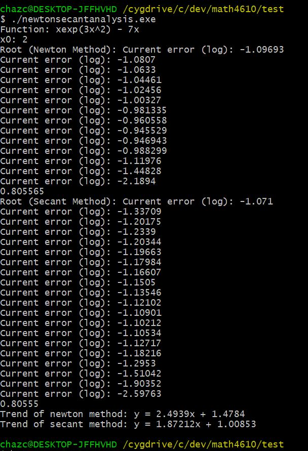
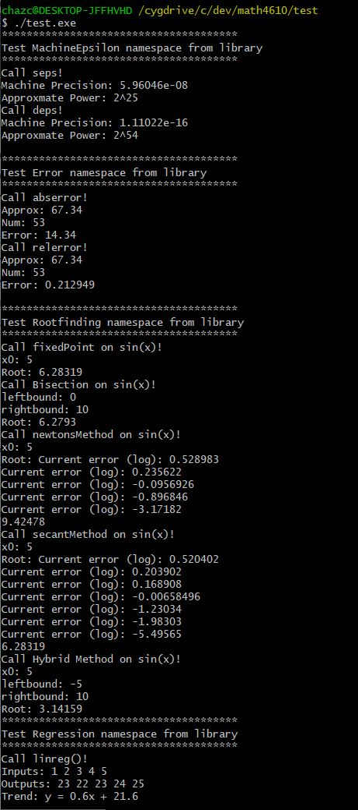

# Solutions for Tasksheet 5
[See here](https://github.com/jvkoebbe/math4610/blob/master/tasksheets/tasksheet_05/pdf/tasksheet_05.pdf) for problem set.

**Task 1**

The software manual entry for newton's method can be found [here](../software_manual/newton.md). The source code for this routine can be found [here](../src/newton.cpp). The image included in Task 3 shows that this routine successfully located a root of the example function

.

**Task 2**

The software manual entry for the secant method can be found [here](../software_manual/secant.md). The source code for this routine can be found [here](../src/secant.cpp). The image included in Task 3 shows that this routine successfully located a root of the function stated in Task 1.

**Task 3 and Task 4**

The image above shows:
1. The output and current error of Rootfinding::newtonMethod()
2. The output and current error of Rootfinding::secantMethod()
3. The trend lines that match the error reduction rate

The source code for the executable that created this above image can be found [here](../test/newtonsecantanalysis.cpp). The error printed to the console is the log10() of the actual error. The trend data was produced by Regression::linreg(). In this instance, newton's method had an approximate computational convergence rate of 2.49, which is slightly better than quadratic convergence. The secant method's approximate rate of computational convergence was 1.87, which is also slightly better than its mathematical convergence rate of 1.62. The software manual entry for this routine can be found [here](../software_manual/linreg.md).

**Task 5**

The software manual entry for the hybrid method can be found [here](../software_manual/hybrid.md). The source code for this routine can be found [here](../src/hybrid.cpp). All of the methods created in this tasksheet have also been successfully implmented into the math4610lib library. [Here](../test/test.cpp) is a test file that I compile to make sure everything is working correctly. Here is the output:

**Task 6**
Rootfinding is a pratical task in field such as science and engineering. Due to the increasing difficulty of finding roots as the order of polynomials increase (no analytical solution exists for 5th order or greater), iteration must be used. Common methods for finding roots are bisection, newton's method, and secant method. The main drawback of newton's method is the necessity of calculating a derivative at every iteration. [http://www.math.niu.edu/~dattab/MATH435.2013/ROOT_FINDING.pdf](http://www.math.niu.edu/~dattab/MATH435.2013/ROOT_FINDING.pdf)
