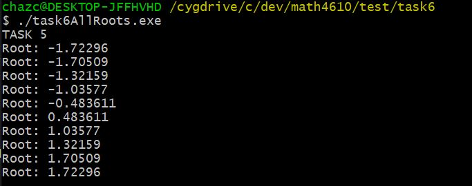

# Solutions for Tasksheet 6
[See here](https://github.com/jvkoebbe/math4610/blob/master/tasksheets/tasksheet_06/pdf/tasksheet_06.pdf) for problem set.

All the tasks in this tasksheet use the following function as an input for the root finding methods:

.

**Task 1**

When I pick a value sufficiently close to zero and close to the root, newton's method and secant method find the root. The fixed point iteration method does not converge unless I make epsilon 0.1. The bisection method also converged to the correct root (closest to zero) if the bounds were evenly spaced about 0 (i.e. [-5,5]). Considering how the bisection algorithm works, this behavior is dependent on the specific function that was used and is not characteristic of the algorithm itself. This image under Task 3 and Task 4 in this sheet shows the output.

**Task 2**

Setting x0 to -5 and 6 did not change the output of newton's method from that from Task 1. If x0 is set too close to zero, the derivative will become zero and newton's method will not converge. 

**Task 3 and Task 4**

The image below shows the output of the methods used to find roots closest to zero. The software manual entries for these methods can be found [here](../software_manual/README.md). The source code for hybridMethodNearestToZero can be found [here](../src/hybrid0.cpp), and the source code for hybridMethodNearestToZeroSecant can be found [here](../src/hybrid0secant.cpp).

**Task 5**

This image below shows the output of the method used to find all zeros in the bracket [-5,6]. The software manual entries for [hybridAllRoots](../src/hybridAllRoots.cpp) can be found [here](../software_manual/README.md).

**Task 6**

The Durand-Kerner method is used for finding the roots of polynomials. Essentially, this method performs simulatenous fixed point iteration for all roots. In polynomials, the number of roots is known by just recording the order of the equations (i.e. x^4 + x^3 + 54x^2 + x = 0 has four roots). The Aberth method is also used for finding the roots of polynomials; however, this method converges quadratically instead of the linear convergence of the Durand-Kerner method. The Aberth method combines strategies from the Durand-Kerner method and Newton's Method. An important characteristc of the methods mentioned above is their slow convergence when there is a multiplicity of zeros. These methods are only linearly convergent in this special case.

https://en.wikipedia.org/wiki/Durand%E2%80%93Kerner_method
https://en.wikipedia.org/wiki/Aberth_method
https://homepage.divms.uiowa.edu/~atkinson/ftp/ENA_Materials/Overheads/sec_3-5.pdf

