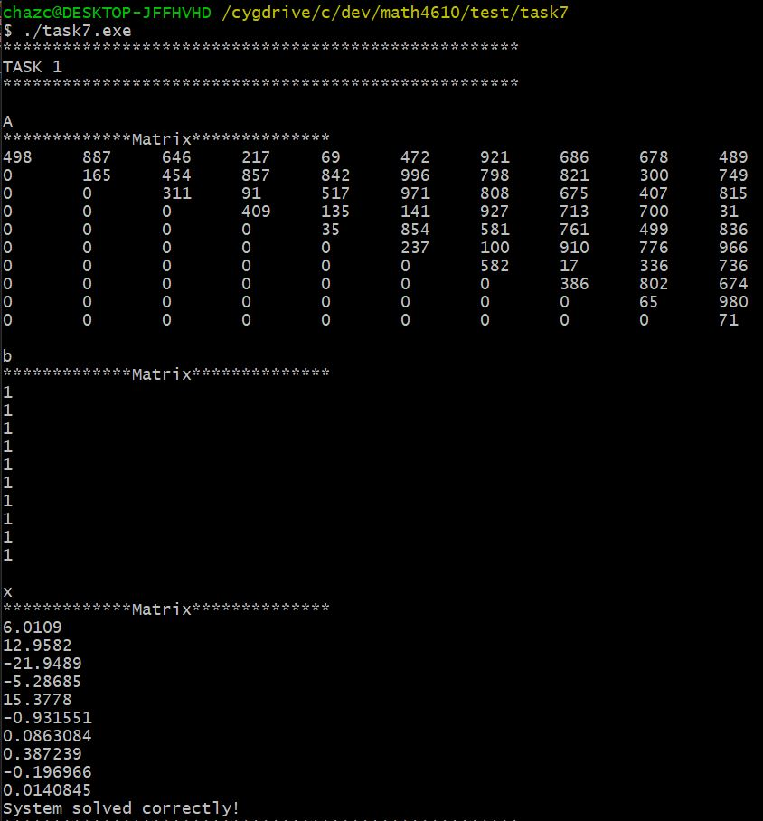
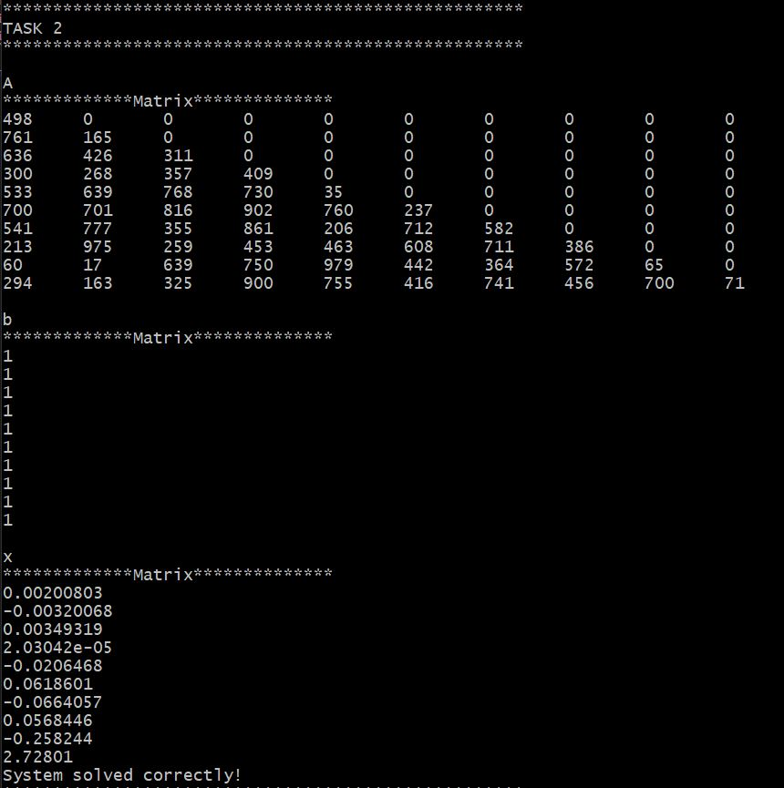
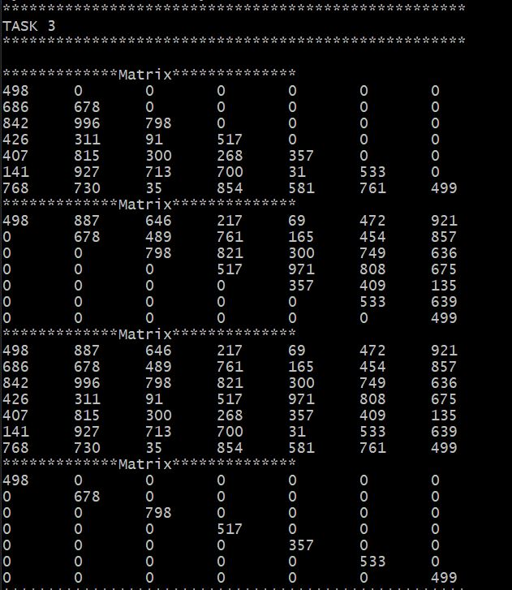
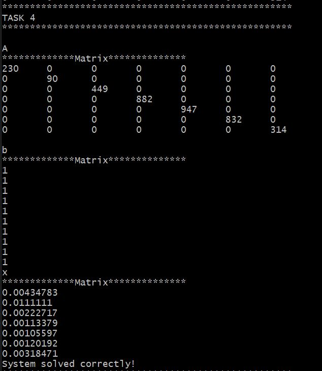
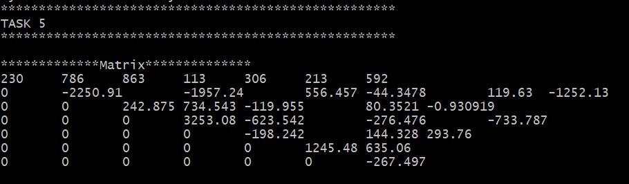

# Solutions for Tasksheet 7
[See here](https://github.com/jvkoebbe/math4610/blob/master/tasksheets/tasksheet_07/pdf/tasksheet_07.pdf) for problem set.

All the tasks in this tasksheet were executed by running a computer program that executes all of the operations required in each task. Each task will have a screenshot of the output that was printed to the console. The source code for this program can be found [here](../test/task7/task7.cpp). To verify that the system of equations was solved correctly, function named

    LinearAlgebra::verifySolution(const LinearAlgebra::Matrix & A, const Linear::Algebra & x, const LinearAlgebra::Matrix & b)
  
is called to double check the solution. The statement "System solved correctly" indicates that this function produced a positive result. The source code for the matrix operations can be found [here](../src/linsolver.cpp).

To facilitate the matrix equation solving, the following namespace was added to the math4610lib.a archive. 

    namespace LinearAlgebra
    {
    enum MatrixType
    {
        UPPR,
        LWR,
        DIAG,
        SQR
    };

    class Matrix
    {
        private:
            const size_t NUM_ROWS;
            const size_t NUM_COLS;
            Matrix reduceRowEchelonPrivate() const;
            Matrix reduceRowEchelon(LinearAlgebra::Matrix & b) const;
            Matrix backSubstitution(const LinearAlgebra::Matrix & b) const;
            Matrix forwardSubstitution(const LinearAlgebra::Matrix & b) const;
        public:
            double ** data;
            Matrix(const int & numRows, const int & numCols, const double & value, MatrixType type);
            Matrix(const int & numRows, const int & numCols, MatrixType type);
            Matrix(const int & numRows, const int & numCols, const double & value);
            size_t getNumRows() const;
            size_t getNumCols() const;
            Matrix solve(LinearAlgebra::Matrix & b) const;
            Matrix solveLWR(LinearAlgebra::Matrix & b) const;
            Matrix duplicate() const;
            Matrix transpose() const;
            void reduceRowEchelon();
            void print(int minRow, int maxRow, int minCol, int maxCol) const;
            void print() const;
            Matrix operator+(const LinearAlgebra::Matrix & operand) const;
            Matrix operator+=(const LinearAlgebra::Matrix & operand) const;
            Matrix operator-(const LinearAlgebra::Matrix & operand) const;
            Matrix operator-=(const LinearAlgebra::Matrix & operand) const;
            Matrix operator*(const double & operand) const;
    };

    bool verifySolution(const LinearAlgebra::Matrix & A, const LinearAlgebra::Matrix & x, const LinearAlgebra::Matrix & b);
    }

**Task 1**

The following code block generated the output seen in the image below. This code is taken directly from the program mentioned at the beginning of this tasksheet. The solve operation consists of row reduction and back substitution. The type of matrix is determined by the last argument in the Matrix constructor. 

    // Task 1
    std::cout << "****************************************************" << std::endl;
    std::cout << "TASK 1" << std::endl;
    std::cout << "****************************************************" << std::endl;
    std::cout << std::endl;

    size_t squareSize = 10;
    LinearAlgebra::Matrix A(squareSize, squareSize, LinearAlgebra::UPPR);
    std::cout << "A" << std::endl;
    A.print();
    std::cout << std::endl;
    LinearAlgebra::Matrix b(squareSize, 1, 1.0);
    std::cout << "b" << std::endl;
    b.print();

    LinearAlgebra::Matrix x = A.solve(b);
    std::cout << std::endl;
    std::cout << "x" << std::endl;
    x.print();
    LinearAlgebra::verifySolution(A, x, b);

**Task 2**

The following code block generated the output seen in the image below. Another solving function (solveLWR) had to be created to accomodate the matrix not being in row echelon form. The solveLWR function used forward substitution to solve the system of equations.

    // Task 2
    std::cout << "****************************************************" << std::endl;
    std::cout << "TASK 2" << std::endl;
    std::cout << "****************************************************" << std::endl;
    std::cout << std::endl;

    LinearAlgebra::Matrix A_LR(squareSize, squareSize, LinearAlgebra::LWR);
    std::cout << "A" << std::endl;
    A_LR.print();
    std::cout << std::endl;
    std::cout << "b" << std::endl;
    b.print();
    LinearAlgebra::Matrix x1 = A_LR.solveLWR(b);
    std::cout << std::endl;
    std::cout << "x" << std::endl;
    x1.print();
    LinearAlgebra::verifySolution(A_LR, x1, b);

**Task 3**

The following code block generated the output seen in the image below. This section illustrates how different types of matrices are created. The used has the choices to initialize a matrix with random values as either a LWR (lower triagular), UPPR (upper triangular), SQR (all indices), or DIAG (diagonal).

    // Task 3
    std::cout << "****************************************************" << std::endl;
    std::cout << "TASK 3" << std::endl;
    std::cout << "****************************************************" << std::endl;
    std::cout << std::endl;

    size_t squareSize2 = 7;
    LinearAlgebra::Matrix A_LWR(squareSize2, squareSize2, LinearAlgebra::LWR);
    A_LWR.print();
    LinearAlgebra::Matrix A_UPPR(squareSize2, squareSize2, LinearAlgebra::UPPR);
    A_UPPR.print();
    LinearAlgebra::Matrix A_ALL(squareSize2, squareSize2, LinearAlgebra::SQR);
    A_ALL.print();
    LinearAlgebra::Matrix A_DIAG(squareSize2, squareSize2, LinearAlgebra::DIAG);
    A_DIAG.print();

**Task 4**

The following code block generated the output seen in the image below. Since all the pivots are non-zero only along the diagonal indices, the each solution in x only requires a single division. The solveDIAG function is basically a stripped-down version of the back substitution function. 

    // Task 4
    std::cout << "****************************************************" << std::endl;
    std::cout << "TASK 4" << std::endl;
    std::cout << "****************************************************" << std::endl;
    std::cout << std::endl;

    std::cout << "A" << std::endl;
    A_DIAG.print();
    std::cout << std::endl;
    std::cout << "b" << std::endl;
    b.print();
    LinearAlgebra::Matrix x2 = A_DIAG.solveDIAG(b);
    std::cout << "x" << std::endl;
    x2.print();

    LinearAlgebra::verifySolution(A_DIAG, x2, b);

**Task 5**

The following code block generated the output seen in the image below. The following lines of code place the matrix A_ALL into row echelon form by berforming subsequent row operations such that the resulting matrix is in upper triangular form.

    // Task 5
    std::cout << "****************************************************" << std::endl;
    std::cout << "TASK 5" << std::endl;
    std::cout << "****************************************************" << std::endl;
    std::cout << std::endl;

    A_ALL.reduceRowEchelon();
    A_ALL.print();
    

**Task 6**

All the columns in A when considering the matrix equation for solving a system of linear equations, Ax = b, must be linearly independent and b must exist in the span of the columns of A [1][3]. If the condition previously stated is satisfied, then the matrix dimensions m and n are equal to each other (the matrix is square), and the inverse of A (A^-1) exists[2]. When solving linear systems of equations on a computer, extra care needs to be taken to avoid pivots that are zero or even close to zero. As values approach machine precision (usually 10^-8 for float and 10^-16 for doubles), the pivots can be become unstable.

[1] https://en.wikipedia.org/wiki/System_of_linear_equations#Properties
[2] https://see.stanford.edu/materials/lsoeldsee263/Additional1c-matrix-primer-lect3.pdf
[3] https://textbooks.math.gatech.edu/ila/matrix-equations.html

