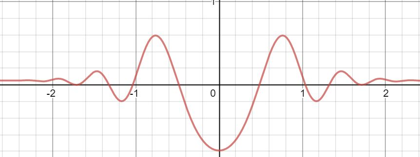

# Solutions for Tasksheet 7
[See here](https://github.com/jvkoebbe/math4610/blob/master/tasksheets/tasksheet_07/pdf/tasksheet_07.pdf) for problem set.

All the tasks in this tasksheet use the following function as an input for the root finding methods:

.

**Task 1**

**Task 2**

**Task 3**

**Task 4**

**Task 5**

**Task 6**

