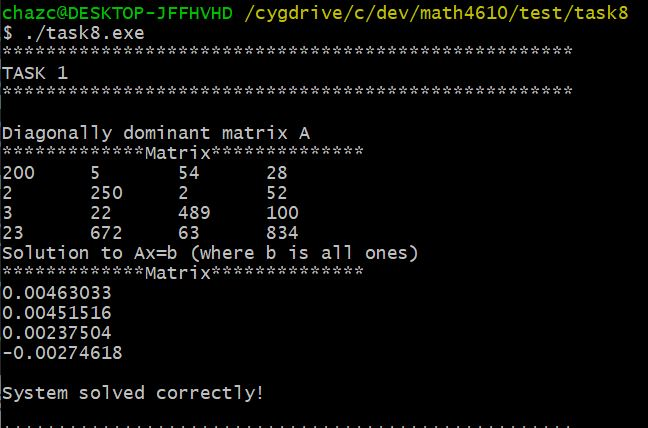
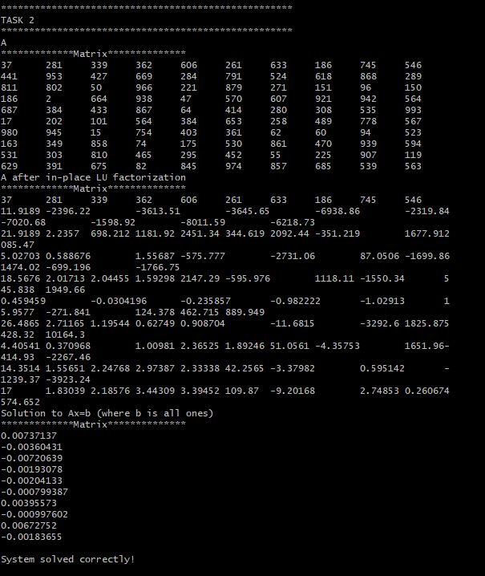
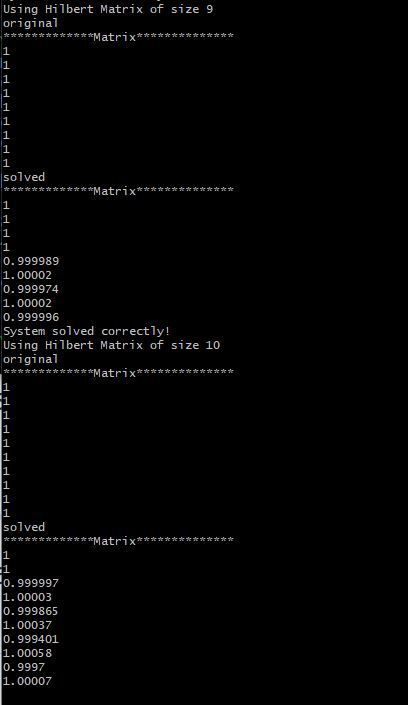
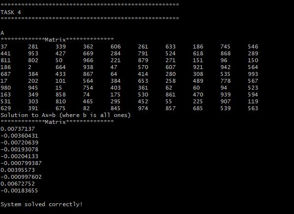
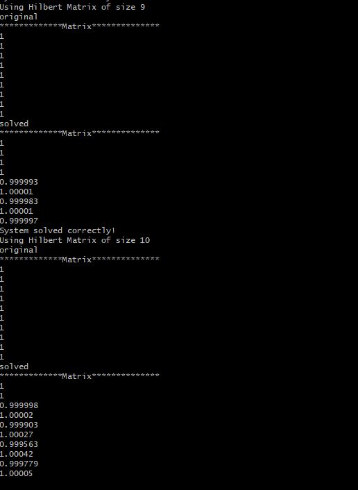
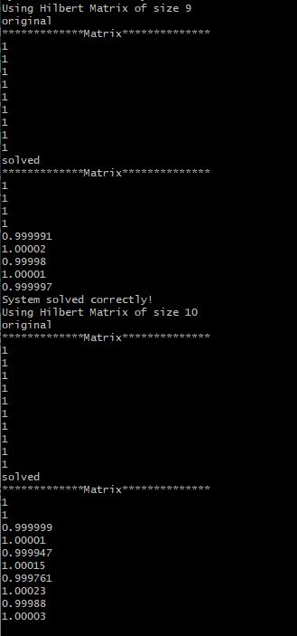

# Solutions for Tasksheet 8
[See here](https://github.com/jvkoebbe/math4610/blob/master/tasksheets/tasksheet_08/html/tasksheet_08.html) for problem set.

A test program was created to executed all of the tasks described in tasksheet 8. This test program can be in the test directory [here](../test/task8/task8.cpp). Each task enumerated below will contain an image of a section of the test program's output. All the source code used to implement the Linear Algebra operations are found [here](../src/linsolver.cpp).

**Task 1**

The image below shows the output of using Gaussian Elimination to solve a diagonally dominant square matrix.

**Task 2**

The image belows shows a system matrix A that was solved using LU factorization. I have two different functions for solving with LU factorization. `solveLU()` can be used on const objects and does not alter the original system matrix A. `solveLUInPlace()` implements the LU factorization within the same memory space as A, so the system matrix A is altered. 

**Task 3**

For Hilbert matrix of size n=4 to n=8, the original and the solved x matrix were exactly the same (all ones exactly). When n > 9, the numerical errors become noticeable. Most 
of the errors are smaller than 10^-4. This may appear to not be a large error, but when considering matrices with thousands or millions of entries, this small numerical error could quickly increase to the point where the output is garbage.

**Task 4**

The image below shows an example of using scaled partial pivoting during gaussian elimination. The effects of the method are not noticeable in the example but become evident when comparing the results of Task 3 and Task 5.

 

**Task 5**

These two image compare the results of using typical Gaussian elimination with backsubstituion without and with a pivoting strategy. Scaled partial pivotting was used in the second image. Some of the errors are decreased by a few thousandths or ten thousandths while other errors are decreased by an order of magnitude. 

**Task 6**
