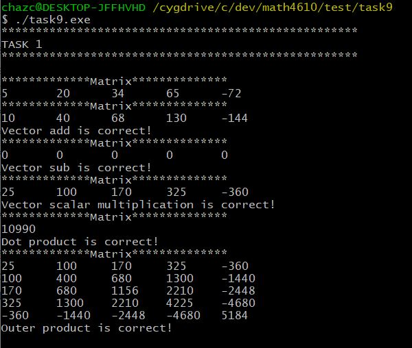
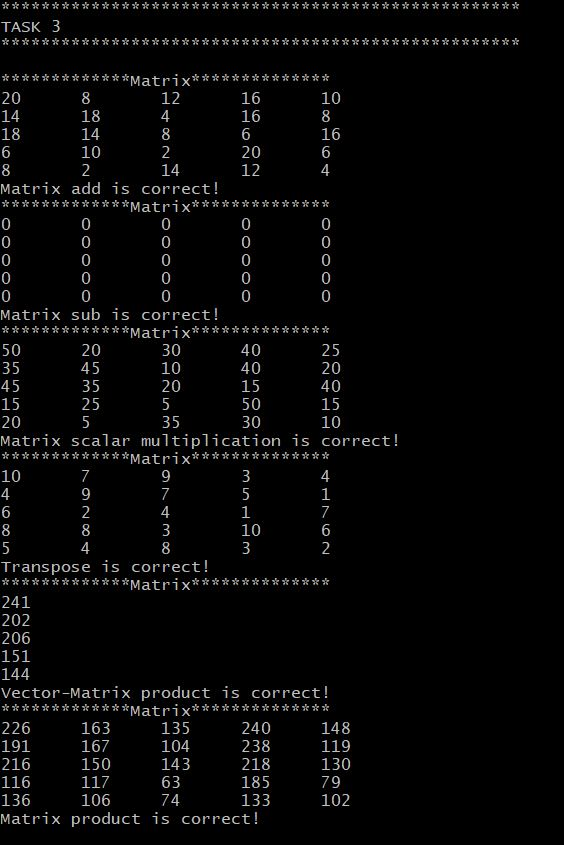
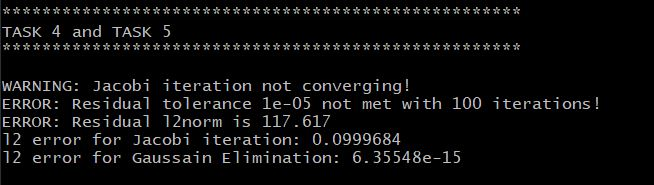

# Solutions for Tasksheet 9
[See here](https://github.com/jvkoebbe/math4610/blob/master/tasksheets/tasksheet_09/html/tasksheet_09.html) for problem set.

A test program was created to executed all of the tasks described in tasksheet 9. This test program can be found in the test directory [here](../test/task9/task9.cpp). Each task enumerated below will contain an image of a section of the test program's output. All the source code used to implement the Linear Algebra operations are found [here](../src/linsolver.cpp).

See [here](../software_manual/README.md) for documentation of important methods in the `LinearAlgebra::Matrix` class that were used in this tasksheet.

**Task 1**

The `LinearAlgebra::Matrix` class supports matrices of all sizes. Therefore, it can also support vectors. In the test code, the vector operation outputs were double-checked. The output below shows the resulting vector or matrix from the operation. Most of the operations are conducted used operator overloads.

Here is the code that executes the operations (where the vectors are `LinearAlgebra::Matrix` objects):

    LinearAlgebra::Matrix sum = vector1 + vector2;
    LinearAlgebra::Matrix diff = vector1 - vector2;
    LinearAlgebra::Matrix scaled = vector1 * 5.0;
    LinearAlgebra::Matrix dot = vector1 * vector3;
    LinearAlgebra::Matrix outer = vector3.outerProd(vector1);

**Task 2**

The screenshot below shows the output of the Norm and Error functions.

Here is the code that produces the Norm and Error results (where the vectors are `LinearAlgebra::Matrix` objects):

    double l1norm = vector1Task2.vectorl1Norm();
    double l2norm = vector1Task2.vectorl2Norm();
    double linfnorm = vector1Task2.vectorlInfNorm();
    
    double l1error = vector1Task2.vectorl1NormError(vector2Task2);
    double l2error = vector1Task2.vectorl2NormError(vector2Task2);
    double linferror = vector1Task2.vectorlInfNormError(vector2Task2);

**Task 3**

The screenshot below shows the output of the matrix operations. 

Here is the code that executes the operations (where A, B, and x are `LinearAlgebra::Matrix` objects):

    LinearAlgebra::Matrix sumMatrix = A + B;
    LinearAlgebra::Matrix diffMatrix = A - B;
    LinearAlgebra::Matrix scaleMatrix = A * 5.0;
    LinearAlgebra::Matrix transpose = A.transpose();
    LinearAlgebra::Matrix prodVectMat = A * x;
    LinearAlgebra::Matrix prod = A * B;

**Task 4**

The Jacobi Iteration method was implemented within the `LinearAlgebra::Matrix` class. This iteration technique DOES NOT work on general matrices. I spent a long time trying to figure out why the iteration was not converging. Then through iternet searches, I realized that the Jacobi Iteration converges only under specific conditions. Once I created a diagonally dominant system matrix, the Jacobi Iteration worked as expected.

Here is the code showing the Jacobi Iteration:

    LinearAlgebra::Matrix LinearAlgebra::Matrix::solveJacobi(const LinearAlgebra::Matrix & b, const double & tolerance, const size_t & maxIterations) const
    {
    Matrix xOld(this->NUM_ROWS, 1, 0.0); // Initial guess;
    Matrix aLU = this->duplicate();
    Matrix aDiag(this->NUM_ROWS, this->NUM_COLS, 0.0);

    // Create inverse diagonal matrix
    for(size_t row = 0; row < NUM_ROWS; row++)
    {
        for(size_t col = 0; col < NUM_COLS; col++)
        {
            if(row == col)
            {
                aDiag[row][col] = 1 / this->data[row][col];
            }
        }
    }

    double error = 10.0 * tolerance;
    double pastError;
    size_t it = 0;

    // Execute Jacobi Iteration using residuals
    while(error > tolerance && it < maxIterations)
    {
        Matrix residual = b - (*this * xOld);
        Matrix xNew = xOld + (aDiag * residual);

        pastError = error;
        error = xNew.vectorl2NormError(xOld);

        if(error > pastError)
        {
            std::cout << "WARNING: Jacobi iteration not converging!" << std::endl;
        }

        xOld.update(xNew);
        it++;
    }
    
    if(it == maxIterations && tolerance > error)
    {
        std::cout << "ERROR: Tolerance " << tolerance << "not met with " << maxIterations << " iterations!" << std::endl;
    }

    return xOld;
    }

**Task 5**

The Gaussian elimination method solves the system of equations much better than the Jacobi Iteration. Once the maximum size of the elements in the system matrix are above 100, the Jacobi iteration struggles. The Jacobi iteration method could be a good replacement for Gaussian elimination if the system matrix is properly conditioned, and the Jacobi iteration converges quickly.

Here is the code:

    LinearAlgebra::Matrix Ajacobi(100, 100, LinearAlgebra::SYM, 10);
    Ajacobi.makeDiagDominant(20.0);
    LinearAlgebra::Matrix xtest(100, 1, 1.0); // Make a test vector of ones
    LinearAlgebra::Matrix bjacobi = Ajacobi * xtest;

    LinearAlgebra::Matrix xjacobi = Ajacobi.solveJacobi(bjacobi, 0.001, 100);
    LinearAlgebra::Matrix xgauss = Ajacobi.solve(bjacobi);

    double errorJacobi = xtest.vectorl2NormError(xjacobi);

    double errorGauss = xtest.vectorl2NormError(xgauss);

**Task 6**

The Jacobi iteration method is used for solving matrices that are diagonally dominant ([https://en.wikipedia.org/wiki/Jacobi_method](https://en.wikipedia.org/wiki/Jacobi_method)). The Gauss-Seidel iteration method is very similar to the Jacobi iteration method. Instead of decomposing the system matrix into additive L, D, and U matrices, the matrix is decomposed into additive L and U matrices. ([https://en.wikipedia.org/wiki/Gauss%E2%80%93Seidel_method](https://en.wikipedia.org/wiki/Gauss%E2%80%93Seidel_method)). The Guass-Seidel interation method can also converge faster than the Jacobi iteration method. ([https://www.maa.org/press/periodicals/loci/joma/iterative-methods-for-solving-iaxi-ibi-gauss-seidel-method](https://www.maa.org/press/periodicals/loci/joma/iterative-methods-for-solving-iaxi-ibi-gauss-seidel-method)). The convergence criteria for the Jacobi and Gauss-Seidel methods are similar except that the Gauss-Seidel method can also guarantee convergence when a system matrix is symmetric, positive definite.
