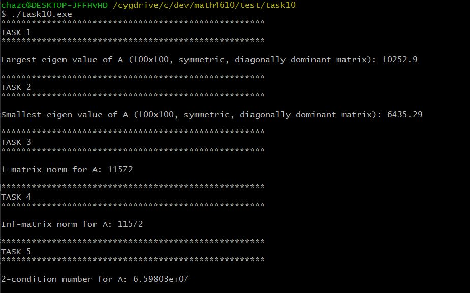

# Solutions for Tasksheet 10
[See here](https://github.com/jvkoebbe/math4610/blob/master/tasksheets/tasksheet_10/html/tasksheet_10.html) for problem set.

A test program was created to executed all of the tasks described in tasksheet 9. This test program can be found in the test directory [here](../test/task10/task10.cpp). All the source code used to implement the Linear Algebra operations are found [here](../src/linsolver.cpp).

See [here](../software_manual/README.md) for documentation of important methods in the `LinearAlgebra::Matrix` class that were used in this tasksheet.

The image below depicts the output of the test program.

**Task 1**

The power method was implemented successfully. This method produces an output that has little error (on the order of 10^-3). This error was determined by using the `LinearAlgebra::verifyEigenVector()` method, which takes a calculated eigen vector as inputer and checks if the equation  is true.

**Task 2**

The inverse power method was implemented successfully; however, there was a nuance that was difficult to resolve. When using the inverse power method, the equation mentioned in Task 2 becomes .

**Task 3**

**Task 4**

**Task 5**

**Task 6**
